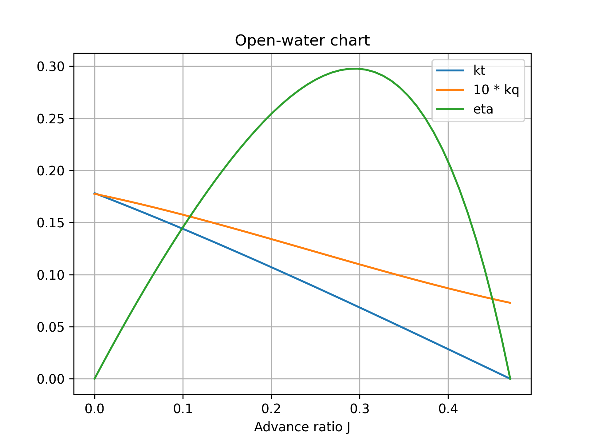
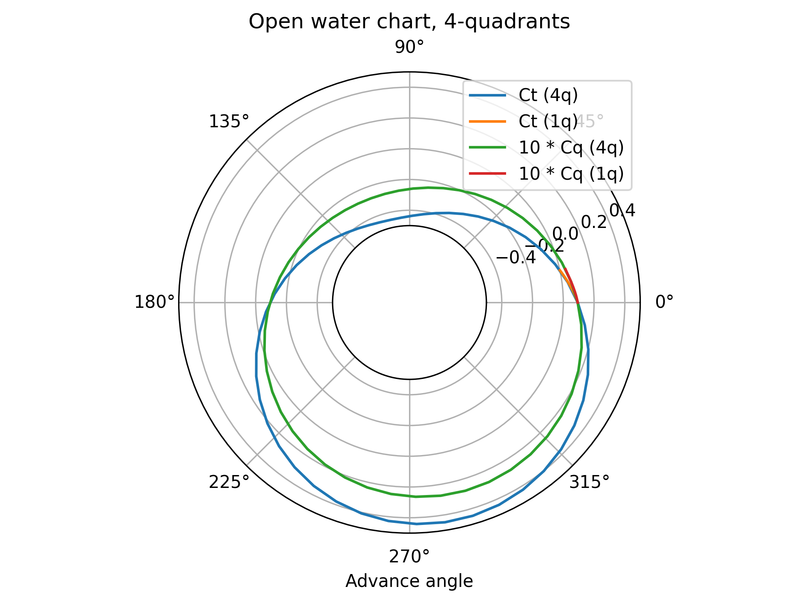

# propy
A package for dimensioning and optimizing (marine) propellers.


## Installation
This package is not (yet?) hosted on the Python Package-index (PyPi), but fortunately the package can still be installed
using `pip`:

```commandline
pip install git+https://github.com/GijsB/propy
```

After installation, the package can be used like any other python package.


## Usage

### Propeller types
The propy module contains parametric propeller models of the following types:
 - `WageningenBPropeller`: The famous Wageningen B-type propeller.
 - `GawnBurrillPropeller`: The Gawn-Burril series.
 - ...


### Convenience functions
To prevent the user from needing to memorize all the definitions open-water models (below), a number of convenience 
functions have been defined. These functions can be used to calculate most important properties of a propeller, they use
the open water models.
- `find_j_for_vt`: Calculate the advance ratio given the speed and thrust.
- `find_j_for_vt_vec`: Calculate the advance ratio given arrays of the speed and thrust.
- `find_j_for_vn`: Calculate the advance ratio given the speed and rotation rate.
- `find_j_for_vn_vec`: Calculate the advance ratio given arrays of the speed and rotation rate.
- `find_beta_for_vn`: Calculate the advance angle of the propeller given the speed and rotation rate.
- `find_beta_for_vn_vec`: Calculate the advance angle of the propeller given arrays of the speed and rotation rate.
- `find_tq_for_vn`: Calculate the thrust and torque for a given speed and rotation rate.
- `find_tq_for_vn_vec`: Calculate arrays of thrust and torque for a given speed and rotation rate.
- `find_nq_for_vt`: Calculate rotation speed and torque for a given speed and thrust.
- `find_nq_for_vt_vec`: Calculate arrays of rotation speed and torque for a given speed and thrust.


### Optimization
Even with all these models (below) and convenient functions, it can be challenging to design propellers. This package 
includes an optimization function for that reason. The `optimize` function is able to minimize an objective function, 
taking into account an arbitrary number of constraints. These objective- and constraint-functions need to be in this
form: `f(p: Propeller) -> float`. The constraints are satisfied when the result is >= 0. 

To aid the user, a number of common objective and constraint functions are available. These functions can be wrapped by
the user to obtain the desired objectives/constraints.:
- `losses(speed, thrust)`: Calculates `1-eta` of the propeller at the given working point.
- `cavitation_margin(thrust, immersion)`: Returns a number that indicates how close the propeller is to cavitating.
- `rotation_speed_margin(speed, thrust, rotation_speed_max)`: Returns a number that indicates how close the propeller is
  to the maximum allowed speed.
- `torque_margin(speed, thrust, torque_max)`: Returns a number that indicates how close the propeller is to the maximum
  allowed torque.
- `tip_speed_margin(speed, thrust, tip_speed_max)`: Returns a number that indicates how close the propeller is to the 
  maximum allowed tip speed.

The code below demonstrates how the `optimize` function can be used to minimize the losses of a 3-bladed propeller when
a limit on the torque needs to be taken into account.

```python
>>> from propy import WageningenBPropeller
>>>
>>> speed = 10
>>> thrust = 1000
>>> torque_limit = 60
>>> 
>>> prop = WageningenBPropeller(
...     blades=3,
... ).optimize(
...     objective=lambda p: p.losses(speed, thrust),
...     constraints=[
...         lambda p: p.torque_margin(speed, thrust, torque_limit)
...     ]
... )
>>> prop
WageningenBPropeller(blades=3, diameter=0.262..., area_ratio=0.3, pd_ratio=1.4)

>>> # Just checking the result
>>> rotation_speed, torque = prop.find_nq_for_vt(speed, thrust)
>>> print(f'{speed=} m/s, {rotation_speed=:1.3} Hz, {torque=:1.3} Nm, {torque_limit=} Nm')
speed=10 m/s, rotation_speed=34.7 Hz, torque=60.0 Nm, torque_limit=60 Nm

```


### Open-water model (1 Quadrant)
The most basic use-case is to use the open-water model of a propeller. Such a model is able to specify the thrust- and
torque-coefficient for different advance-ratio's. These coefficients are defined as follows:
 - Advance ratio: `j = speed / rotation_speed / diameter`, `0 <= j <= j_max`
 - Thrust coefficient: `kt(j) = thrust / rho / rotation_speed^2 / diameter^4`, `kt_min <= kt <= kt_max `
 - Torque coefficient: `kq(j) = torque / rho / rotation_speed^2 / diameter^5`, `kq_min <= kq <= kq_max`

The code below shows how the open water model kan be used to obtain the thrust and torque produced by the propeller.

```python
>>> from propy import WageningenBPropeller
>>>
>>> speed = 10  # 10 m/s speed
>>> rotation_speed = 20  # 20 Hz rotation speed
>>> rho = 1000  # 1000 kg/m3 water density
>>>
>>> prop = WageningenBPropeller()
>>>
>>> j = speed / rotation_speed / prop.diameter
>>> thrust = prop.kt(j) * rho * rotation_speed**2 * prop.diameter**4
>>> torque = prop.kq(j) * rho * rotation_speed**2 * prop.diameter**5
>>> efficiency = prop.eta(j)
>>>
>>> print(f'{j=:1.2}, {thrust=:1.2} N, {torque=:1.2} Nm, {efficiency=:1.2}')
j=0.5, thrust=6.9e+04 N, torque=9.5e+03 Nm, efficiency=0.58

```

The code below shows how an open-water chart can conveniently be generated
```python
import numpy as np
import matplotlib.pyplot as plt

from propy import WageningenBPropeller

prop = WageningenBPropeller(
    diameter=0.3,
    blades=2,
    area_ratio=0.9,
    pd_ratio=0.5
)

j = np.linspace(0, prop.j_max)

plt.figure()
plt.plot(j, prop.kt(j), label='kt')
plt.plot(j, prop.kq(j)*10, label='10*kq')
plt.plot(j, prop.eta(j), label='eta')

plt.xlabel('Advance ratio J')
plt.title(f'Open-water chart')
plt.grid()
plt.legend()
```




### 4-Quadrant model
The open-water model can only be used to calculate working points where the propeller is actually "propelling". When the
propeller is breaking of reversing, a 4-quadrant model must be used. The propeller characteristics for these working 
points can be very complex. Although some data is available, this is not currently implemented in this library. Instead,
a simple function fit is used to get a very rough approximation.

The 4-quadrant model has 3 main coefficients, which are somewhat similar to the 1-quadrant model:
- The load angle: 
  - `beta = atan(speed / 0.7 / pi / rotation_speed / diameter)`
  - `beta = atan(j / 0.7 / pi)`
- The thrust coefficient:
  - `ct = 8 * thrust / (speed^2 + (0.7 * pi * rotation_speed * diameter)^2) / pi / rho / diameter^2`
  - `ct = 8 * kt / pi / (j^2 + 0.7^2 * pi^2)`
- The torque coefficient:
  - `cq = 8 * torque / (speed^2 + (0.7 * pi * rotation_speed * diameter)^2) / pi / rho / diameter^3`
  - `cq = 8 * kq / pi / (j^2 + 0.7^2 * pi^2)`

The code below shows how the 4-quadrant model can give an estimate of the thrust and drag for a working point with a
very low rotation speed. At this working point, the advance ratio would be higher than `j_max`, so the 1-quadrant model
cannot be used.

```python
>>> from propy import WageningenBPropeller
>>> from math import atan, pi
>>>
>>> speed = 10  # 10 m/s speed
>>> rotation_speed = 10  # 10 Hz rotation speed
>>> rho = 1000  # 1000 kg/m3 water density
>>>
>>> prop = WageningenBPropeller()
>>>
>>> j = speed / rotation_speed / prop.diameter
>>> beta = atan(j / 0.7 / pi)
>>> thrust = prop.ct(beta) * (speed**2 + (0.7 * pi * rotation_speed * prop.diameter)**2) * pi * rho * prop.diameter**2 / 8
>>> torque = prop.cq(beta) * (speed**2 + (0.7 * pi * rotation_speed * prop.diameter)**2) * pi * rho * prop.diameter**3 / 8
>>>
>>> print(f'{j=:1.2}, {beta=:1.2} rad, {thrust=:1.2} N, {torque=:1.2} Nm')
j=1.0, beta=0.43 rad, thrust=-4.7e+03 N, torque=-2.7e+01 Nm

```

The code below shows how an open-water chart can conveniently be generated. There's also a comparison with the range and
outcome of the standard 1-quadrant model.

```python
import numpy as np
import matplotlib.pyplot as plt

from propy import WageningenBPropeller

prop = WageningenBPropeller(
    diameter=0.3,
    blades=2,
    area_ratio=0.9,
    pd_ratio=0.5
)

j = np.linspace(0, prop.j_max)
ct_1q = 8 * prop.kt(j) / np.pi / (j**2 + 0.7**2 * np.pi**2)
cq_1q = 8 * prop.kq(j) / np.pi / (j**2 + 0.7**2 * np.pi**2)

beta = np.linspace(0, 2 * np.pi)
ct = prop.ct(beta)
cq = prop.cq(beta)

plt.figure()
plt.polar(beta, ct, label='Ct (4q)')
plt.polar(np.atan(j / 0.7 / np.pi), ct_1q, label="Ct (1q)")
plt.polar(beta, cq * 10, label='10 * Cq (4q)')
plt.polar(np.atan(j / 0.7 / np.pi), cq_1q * 10, label="10 * Cq (1q)")

plt.gca().set_rorigin(-1)
plt.gca().set_rmin(-0.5)
plt.gca().set_rmax(0.5)
plt.xlabel('Advance angle')
plt.legend()
plt.title('Open water chart, 4-quadrants')
```




## Development

### Installation
To work on the development of this project, the project needs to be cloned locally. It can be convenient to install the 
package in "editable" mode. It's also recommended to install all the dependencies in a local venv.

**MacOS/Linux**
```commandline
git clone git@github.com:GijsB/propy.git
cd propy
python -m venv .venv
source .venv/bin/activate
pip install -e ".[dev]"
```

**Windows**
```commandline
git clone git@github.com:GijsB/propy.git
cd propy
python -m venv .venv
source .venv\Scripts\activate.bat
pip install -e ".[dev]"
```


### Git workflow
The main branch only contains releases, which are also tagged with the version number. When it's a good time for a new 
release, the changes from the develop branch are pulled into the main branch. New features are developed in 
`feature/...` branches. These changes are reviewed in a GitHub pull-request. After all the checks are passed, they can 
be merged into the develop branch. 


### Testing & validation
The following steps could be performed manually during development, but are also tested upon each pull-request.
- The code style is tested using `flake8 .`
- The type checking can be performed using `mypy .`
- The unit tests can be executed using `pytest .`


### Test status:
- Main branch: 
- Develop branch: 